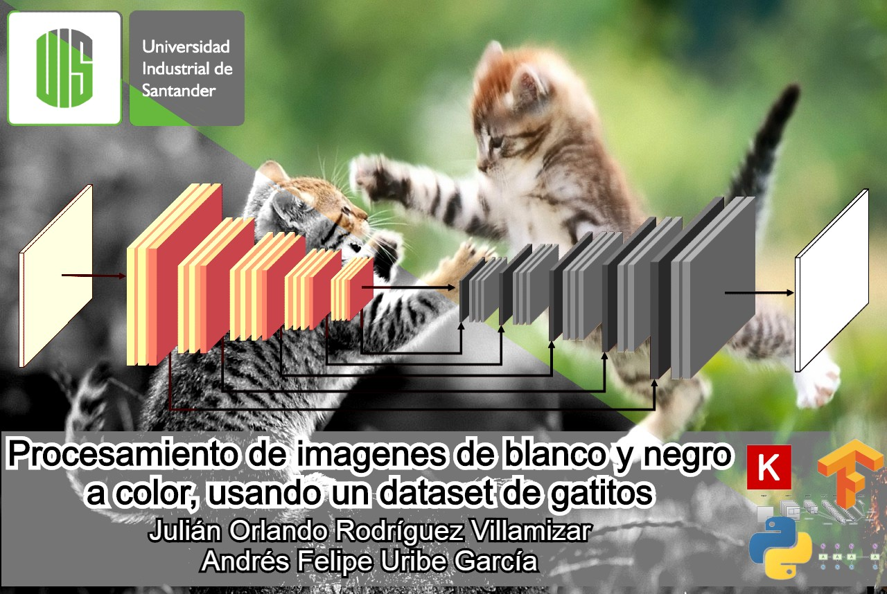

# Procesamiento de imagenes de blanco y negro a color, usando un dataset de gatitos (BN_CL)

Escuela de Ingeniería de Sistemas e Informática
INTELIGENCIA ARTIFICIAL I - Grupo JI

**Autores**|Código| E-mail
--|--|--
Andrés Felipe Uribe García | 2160793 | andresfelipeuribe11@gmail.com
Julian Orlando Rodríguez Villamizar | 2170137 | julian.orv99@gmail.com

## Dataset:

Los datos provienen del dataset [Dogs & Cats Images](https://www.kaggle.com/chetankv/dogs-cats-images) el cual fue utilizado para un problema de clasificación binaria de perros y gatos

Para el preprocesado del dataset de gatos se utilizó un for en bash con la instrución
convert i.jpg -colorspace Gray i.jpg
La cual transforma todas las imagenes de color a escala de grises utilizando la aplicación ImageMagick, la cual tambien ofrece otro tipo de transformaciones
Tutorial rapido: https://blog.desdelinux.net/como-manipular-imagenes-desde-el-terminal/ Proyecto: https://github.com/ImageMagick/ImageMagick

* **test_set/cats**         1000 imagenes
* **test_set/dogs**         1000 imagenes
* **training_set/cats**     5000 imagenes
* **training_set/dogs**     5000 imagenes

## Algoritmos utilizados:

GAN - Redes Generativas Antagónicas (RGAs)

## Enlaces de interés:

1. [Codigo](https://github.com/LotusZaheer/BN_CL/blob/master/Index.ipynb)
2. [Video youtube](https://youtu.be/UV86tAkSriM)
